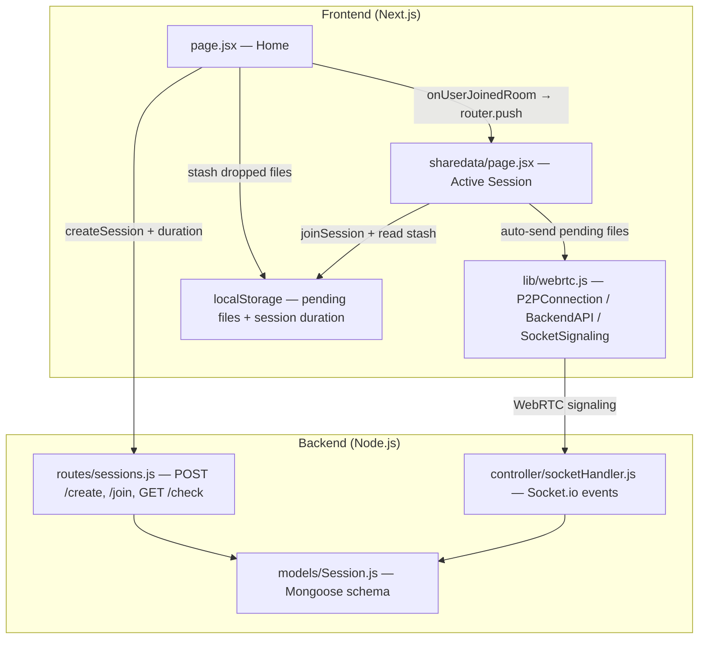
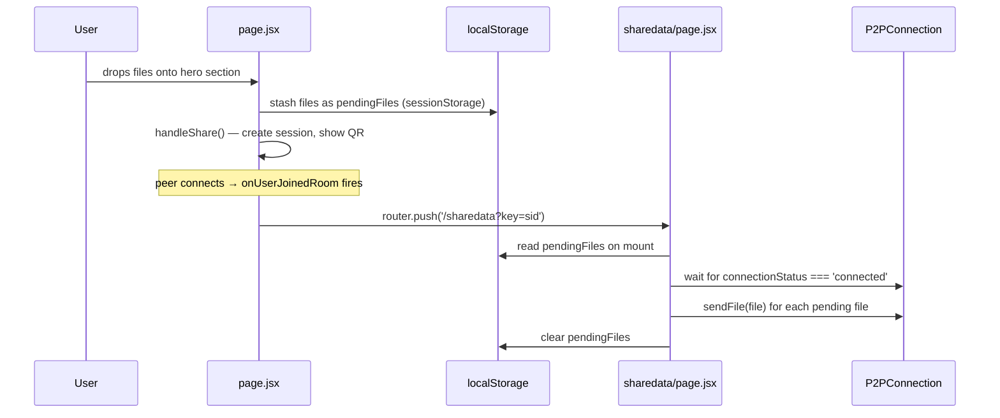
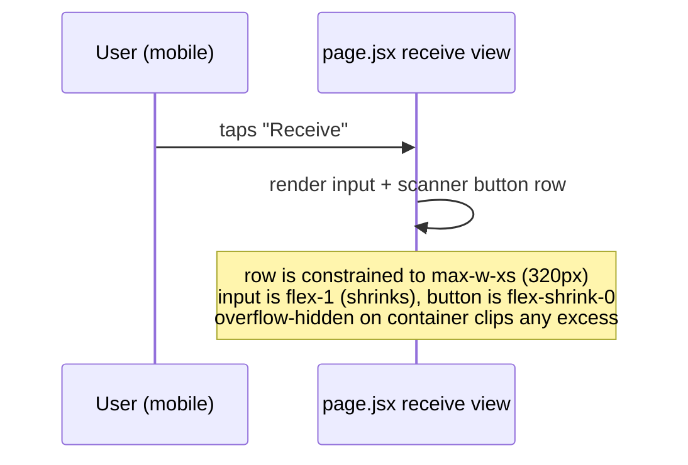
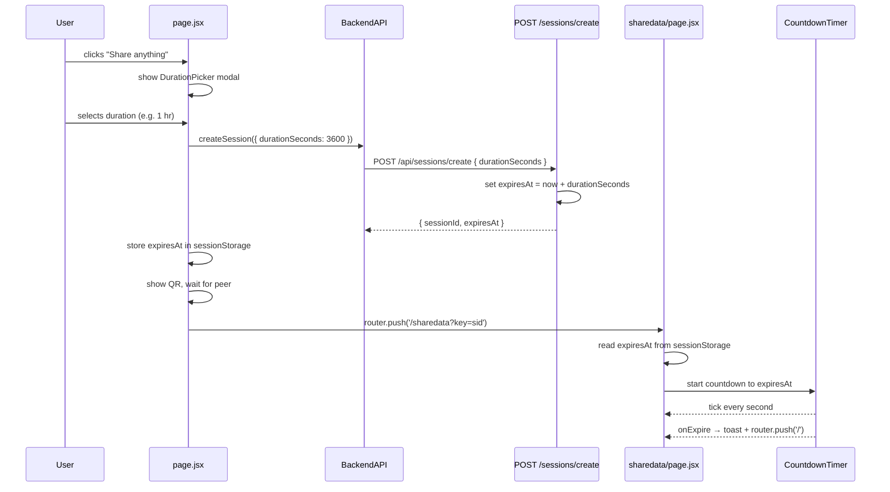

# Design Document: session-ux-fixes

## Overview

This spec covers three improvements to the file-sharing web app: fixing drag-and-drop files being lost before a session connects, fixing the QR scanner button overflowing on mobile, and adding user-controlled session duration with a live countdown and expiry redirect.

The app is a Next.js frontend (`frequent-share/`) paired with a Node.js/Express/Socket.io backend (`frequent_backend/`). Files are transferred peer-to-peer via WebRTC; the backend only handles signaling and session metadata.

---

## Architecture



---

## Sequence Diagrams

### Fix 1 — Drag-and-drop auto-send



### Fix 2 — Scanner button mobile overflow



### Feature 3 — Session time management



---

## Components and Interfaces

### Component 1: DurationPicker (new, inline in page.jsx)

**Purpose**: Modal/inline UI shown before session creation that lets the user pick a session duration.

**Interface**:
```typescript
interface DurationPickerProps {
  onConfirm: (durationSeconds: number) => void
  onCancel: () => void
}

type DurationOption = {
  label: string       // "5 min", "1 hr", etc.
  seconds: number
}
```

**Responsibilities**:
- Render preset duration buttons (5 min, 10 min, 30 min, 1 hr, 2 hr)
- Highlight selected option
- Call `onConfirm(seconds)` when user proceeds
- Default selection: 1 hr (3600 s)

---

### Component 2: CountdownTimer (new, inline in sharedata/page.jsx)

**Purpose**: Displays remaining session time and triggers expiry behaviour.

**Interface**:
```typescript
interface CountdownTimerProps {
  expiresAt: number        // Unix ms timestamp
  onExpire: () => void     // called once when time reaches 0
}
```

**Responsibilities**:
- Compute `remaining = expiresAt - Date.now()` every second via `setInterval`
- Format as `mm:ss` (or `h:mm:ss` when ≥ 1 hr remaining)
- Call `onExpire()` when remaining ≤ 0, then clear interval
- Show warning colour (amber) when < 5 min remaining

---

### Component 3: page.jsx — modified handleDrop + handleShare

**Purpose**: Stash dropped files before session exists, then trigger auto-send after navigation.

**Interface** (internal state additions):
```typescript
// New state in HomeContent
const [pendingDuration, setPendingDuration] = useState<number | null>(null)
const [showDurationPicker, setShowDurationPicker] = useState(false)

// sessionStorage keys
const PENDING_FILES_KEY = 'pendingDropFiles'   // not usable — File objects aren't serialisable
// Instead: store files in a module-level ref passed via sessionStorage flag
const PENDING_FLAG_KEY  = 'hasPendingFiles'    // "true" | absent
```

**Note on File serialisation**: `File` objects cannot be stored in `localStorage`/`sessionStorage`. The solution is to keep them in a module-level variable (`window.__pendingFiles`) that survives the same-tab `router.push()` navigation (no full page reload in Next.js).

---

### Component 4: sharedata/page.jsx — auto-send on connect

**Purpose**: After navigating from home with pending files, send them once P2P connects.

**Interface** (internal additions):
```typescript
// Read on mount
const pendingFiles: File[] = window.__pendingFiles ?? []

// After connectionStatus transitions to 'connected'
useEffect(() => {
  if (connectionStatus !== 'connected') return
  if (!pendingFiles.length) return
  pendingFiles.forEach(file => handleFileShare(file))
  window.__pendingFiles = []
}, [connectionStatus])
```

---

## Data Models

### Session (MongoDB — updated)

```typescript
interface SessionDocument {
  sessionId:   string    // 6-char alphanumeric, unique
  createdAt:   Date      // default: now
  expiresAt:   Date      // new — replaces implicit TTL; indexed with expireAfterSeconds: 0
  durationSeconds: number // new — stored for reference / display
  status:      'active' | 'completed'
}
```

**Changes from current schema**:
- Remove `expires: 7200` from `createdAt` field
- Add `expiresAt: { type: Date, index: { expireAfterSeconds: 0 } }` — MongoDB TTL index on this field
- Add `durationSeconds: { type: Number, default: 3600 }`

**Validation rules**:
- `durationSeconds` must be one of: 300, 600, 1800, 3600, 7200 (or any positive integer if custom is added)
- `expiresAt` = `createdAt + durationSeconds * 1000`

---

### POST /api/sessions/create — updated request/response

```typescript
// Request body
interface CreateSessionRequest {
  durationSeconds?: number   // optional, default 3600
}

// Response
interface CreateSessionResponse {
  success:    boolean
  sessionId:  string
  expiresAt:  string   // ISO 8601 timestamp
  durationSeconds: number
}
```

---

### GET /api/sessions/check/:id — updated response

```typescript
interface CheckSessionResponse {
  success:    boolean
  exists:     boolean
  sessionId?: string
  expiresAt?: string        // new — frontend uses this to start countdown
  durationSeconds?: number  // new
}
```

---

## Key Functions with Formal Specifications

### handleDrop (page.jsx)

```typescript
function handleDrop(e: DragEvent): void
```

**Preconditions**:
- `e.dataTransfer.files` contains ≥ 1 file
- Component is mounted

**Postconditions**:
- `window.__pendingFiles` is set to the array of dropped `File` objects
- `handleShare()` is called (which shows DurationPicker if no session exists)
- No files are lost regardless of whether a session already exists

**Current bug**: `handleDrop` calls `handleShare()` but discards `e.dataTransfer.files`. Fix: capture files first, store in `window.__pendingFiles`, then call `handleShare()`.

---

### handleShare (page.jsx) — updated

```typescript
async function handleShare(durationSeconds: number = 3600): Promise<void>
```

**Preconditions**:
- `isCreating === false`
- `session === null`
- `durationSeconds` is a positive integer

**Postconditions**:
- Session created on backend with correct `expiresAt`
- `expiresAt` stored in `sessionStorage` under key `'sessionExpiresAt'`
- QR code displayed
- Socket listener registered; on `user-joined` → `router.push('/sharedata?key=sid')`

---

### auto-send effect (sharedata/page.jsx)

```typescript
useEffect((): void => {
  // fires when connectionStatus changes
}, [connectionStatus])
```

**Preconditions**:
- `connectionStatus === 'connected'`
- `window.__pendingFiles` is a non-empty array

**Postconditions**:
- Each file in `window.__pendingFiles` is passed to `handleFileShare(file)`
- `window.__pendingFiles` is cleared to `[]`
- Effect does not re-run (files are cleared immediately)

**Loop invariant**: For each file `f` processed, `handleFileShare(f)` has been called before moving to `f+1`.

---

### CountdownTimer tick logic

```pascal
PROCEDURE tickCountdown(expiresAt, onExpire)
  INPUT: expiresAt (Unix ms), onExpire (callback)
  OUTPUT: side-effects only

  SEQUENCE
    remaining ← expiresAt - Date.now()

    IF remaining <= 0 THEN
      onExpire()
      clearInterval(intervalId)
      RETURN
    END IF

    hours   ← FLOOR(remaining / 3_600_000)
    minutes ← FLOOR((remaining MOD 3_600_000) / 60_000)
    seconds ← FLOOR((remaining MOD 60_000) / 1_000)

    IF hours > 0 THEN
      display ← format("{h}:{mm}:{ss}", hours, minutes, seconds)
    ELSE
      display ← format("{mm}:{ss}", minutes, seconds)
    END IF

    setDisplayTime(display)
    setIsWarning(remaining < 300_000)   // amber when < 5 min
  END SEQUENCE
END PROCEDURE
```

**Preconditions**: `expiresAt > Date.now()` when interval starts  
**Postconditions**: `onExpire` called exactly once when `remaining ≤ 0`  
**Loop invariant**: `remaining` strictly decreases by ~1000 ms each tick

---

## Algorithmic Pseudocode

### Main flow — drag-drop to auto-send

```pascal
ALGORITHM dragDropAutoSend
INPUT: droppedFiles (File[])
OUTPUT: files sent to peer after session connects

BEGIN
  // Phase 1: Home page
  window.__pendingFiles ← droppedFiles
  setShowDurationPicker(true)

  // User picks duration
  durationSeconds ← awaitUserSelection()   // default 3600

  // Create session
  response ← BackendAPI.createSession({ durationSeconds })
  sessionStorage.setItem('sessionExpiresAt', response.expiresAt)

  showQR(response.sessionId)

  // Wait for peer
  sig.onUserJoinedRoom(() =>
    router.push('/sharedata?key=' + response.sessionId)
  )

  // Phase 2: sharedata page (after navigation)
  pending ← window.__pendingFiles   // still in memory — same tab

  WAIT UNTIL connectionStatus = 'connected'

  FOR each file IN pending DO
    handleFileShare(file)
  END FOR

  window.__pendingFiles ← []
END
```

---

### Session expiry flow

```pascal
ALGORITHM sessionExpiryFlow
INPUT: expiresAt (ISO string from sessionStorage)
OUTPUT: redirect to home when expired

BEGIN
  ts ← Date.parse(expiresAt)

  IF ts IS NaN OR ts <= Date.now() THEN
    router.push('/')
    RETURN
  END IF

  intervalId ← setInterval(tickCountdown, 1000)

  ON COMPONENT UNMOUNT DO
    clearInterval(intervalId)
  END ON
END
```

---

## Error Handling

### Error Scenario 1: No duration selected / picker dismissed

**Condition**: User closes DurationPicker without selecting  
**Response**: Default to 3600 s (1 hr) and proceed with session creation  
**Recovery**: No user action needed

---

### Error Scenario 2: `window.__pendingFiles` is empty on sharedata mount

**Condition**: User navigated to `/sharedata` directly (no drag-drop)  
**Response**: Skip auto-send effect silently  
**Recovery**: User manually uploads files as normal

---

### Error Scenario 3: `sessionExpiresAt` missing from sessionStorage

**Condition**: User opened `/sharedata` link directly in a new tab  
**Response**: No countdown shown; session behaves as before (MongoDB TTL still cleans up)  
**Recovery**: No action needed — graceful degradation

---

### Error Scenario 4: Backend returns invalid `expiresAt`

**Condition**: Parse error or missing field  
**Response**: Log warning, skip countdown, do not redirect  
**Recovery**: Session continues normally; MongoDB TTL handles cleanup

---

### Error Scenario 5: Scanner button overflow (Fix 2)

**Condition**: Viewport < 375 px wide  
**Response**: Container uses `overflow-hidden` + `flex-shrink-0` on button; input shrinks via `flex-1 min-w-0`  
**Recovery**: Layout is purely CSS — no JS needed

---

## Testing Strategy

### Unit Testing Approach

- `tickCountdown`: test formatting at 0 s, 59 s, 3599 s, 3600 s; test `onExpire` called exactly once at 0
- `handleDrop`: assert `window.__pendingFiles` is populated before `handleShare` is called
- `handleShare`: assert `sessionStorage.setItem('sessionExpiresAt', ...)` is called with a valid ISO string
- Session model: assert `expiresAt = createdAt + durationSeconds * 1000`

### Property-Based Testing Approach

**Property Test Library**: fast-check

- For any `durationSeconds` in [1, 86400], `expiresAt - createdAt === durationSeconds * 1000`
- For any `remaining` in [0, MAX_SAFE_INTEGER], `tickCountdown` never throws and always produces a valid `mm:ss` or `h:mm:ss` string
- For any array of `File` objects dropped, all files appear in `window.__pendingFiles` with no duplicates lost

### Integration Testing Approach

- E2E: drag files → session created → peer joins → files auto-sent (Playwright)
- Mobile viewport (375 px): receive view renders without horizontal scroll
- Session expiry: create session with 5 s duration → countdown reaches 0 → page redirects to `/`

---

## Performance Considerations

- `setInterval` for countdown fires every 1 s — negligible overhead; must be cleared on unmount to avoid memory leaks
- `window.__pendingFiles` holds `File` object references (not copies) — no memory duplication
- MongoDB TTL index on `expiresAt` is more precise than the current `createdAt + expires` approach and requires no schema migration beyond adding the field

---

## Security Considerations

- `durationSeconds` is validated server-side: must be a positive integer ≤ 86400 (24 hr max) to prevent sessions that never expire
- `window.__pendingFiles` is tab-local and never serialised — no XSS surface
- `expiresAt` stored in `sessionStorage` (not `localStorage`) — cleared when tab closes

---

## Dependencies

- No new npm packages required
- Existing: `mongoose`, `socket.io`, `next`, `react`, `react-hot-toast`, `motion/react`
- MongoDB TTL index change requires a one-time index drop/recreate on the `sessions` collection (or use `dropIndex` + `createIndex` in a migration script)
